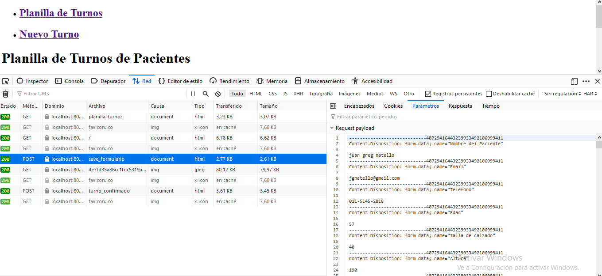

<h1>Trabajo Practico  
Tecnologias del Lado del Servidor</h1>  

1) Elabore una aplicación que presente al usuario un formulario implementado por HTML para la
carga de los datos de una persona que solicita turno médico) El formulario deberá disponer de los
siguientes campos :   
    a) Nombre del paciente (obligatorio) 
    b) Email (obligatorio) 
    c) Teléfono (obligatorio) 
    d) Edad 
    e) Talla de calzado (desde 20 a 45 enteros) 
    f) Altura (usando la herramienta de deslizador) 
    g) Fecha de nacimiento (obligatorio)  
    h) Color de pelo (Usando un elemento select con las opciones que usted considere adecuadas) 
    i) Fecha del turno (obligatorio) 
    j) Horario del turno (Entre las 8:00 hasta las 17:00 con turnos cada 15 minutos) 
    k) 2 botones: Enviar y Limpiar.  

Todos los elementos del formulario deben validarse del lado de cliente y servidor , con el formato
que mejor se ajuste y permitan HTML y PHP. Además, tomar en cuenta de validar que los datos
ingresados se encuentren en los rangos especificados. ¿Por qué cree usted que se requiere validar
los datos en ambos extremos de la comunicación?  

Respuesta: La razon por la cual se requiere es que, del lado del cliente solo se pueden verificar 
el formator de los datos, es decir, formato de fecha, de email, rango de datos acotados como altura, edad, etc.
Pero lo que solo se puede verificar del lado del servidor es la consistencia de los mismos; un ejemplo de ello es
la fecha de turno, se debe verificar que sea superior o igual a la actual, y asimismo que no sea un dia no laborable. 
Ademas se puede verificar relacion entre campos, como puede ser la edad y la fecha de nacimiento, deben ser consistentes.

Nota: La hora del Turno no esta tildada como obligatoria, sin embargo para la implementacion del codigo 
que arme, la considere como obligatoria. las razones son que del lado del servidor, debo evitar que  
se reserve un turno en la misma fecha y hora, y la carga de la hora debe estar siempre, a mi consideracion.

2) Extienda el ejercicio anterior para que al enviar el formulario mediante el método POST se muestre
al usuario un resumen del turno.   

En el siguiente commit se encuentra realizada la resolucion de los puntos 1 y 2. 

- https://github.com/jnatmed/tp2-php-paw/commit/30a74eff839939d449ddd4f2727f116267eb4609

3) Realice las modificaciones necesarias para que el script del punto anterior reciba los datos
mediante el método GET . ¿Qué diferencia nota? ¿Cuándo es conveniente usar cada método?  

En este commit se puede ver como al cambiar los campos correspondientes para el uso mediante GET
los datos del usuario viajan mediante la URL del usuario. Dependiendo del caso, si la informacion 
no es sensible, se puede optar por usar un metodo de envio mediante GET, caso constrario debe usarse
POST. 

Un detalle no menor para agregar, es que si en el formulario se agrega la insercion de una imagen
no se puede usar el metodo GET para el envio de la misma, en este caso el uso de POST es obligatorio.   

Utilizando las herramientas de Navegador (Pestaña Red), se puede observar que la informacion viaja en el encabezado, mediante GET. 

- https://github.com/jnatmed/tp2-php-paw/commit/cc8579347e386a09ef0065adb35bdd8cade79076

4) Agregue al formulario un campo que permita adjuntar una imagen , y que la etiqueta del campo sea
Diagnóstico. El campo debe validar que sea un tipo de imagen valido (.jpg o .png) y será optativo.
La imagen debe almacenarse en un subdirectorio del proyecto y también debe mostrarse al
usuario al mostrar el resumen del turno del ejercicio 2. ¿Qué sucede si 2 usuarios cargan imágenes
con el mismo nombre de imagen? ¿Qué mecanismo implementar para evitar que un usuario
sobrescriba una imagen con el mismo nombre?

¿Qué sucede si 2 usuarios cargan imágenes con el mismo nombre de imagen?
Pude notar que efectivamente la imagen se sobreescribe, si dos usuarios suben una imagen con el 
mismo nombre.  

¿Qué mecanismo implementar para evitar que un usuario sobrescriba una imagen con el mismo nombre? 
Una forma de hacerlo es concatenar "la fecha del turno" + "la hora del turno" y pasarlo por una 
funcion HASH, usando el modulo "md5" de php; de esta forma evitando que dos pacientes reserven un turno
en la misma fecha y hora, que eso ya forma parte de las primeras  restricciones en carga de datos, 
se independiza el nombre con que cargue la imagen de la receta, ya que sera cambiada por una manejada 
por el sistema.  

5) Utilice las herramientas para desarrollador del navegador y observe cómo fueron codificados por
el navegador los datos enviados por el navegador en los dos ejercicios anteriores. ¿Qué diferencia
nota?

Se puede notar en la pestaña de red que cuando se envia el formulario mediante POST, los datos viajan  
en el cuerpo de la peticion, se puede ver en el request payload.  

 mientras que en una peticion GET se puede observar que los datos viajan en la URL de la peticion. 

6) Agregar persistencia al sistema de turnos. Todos los datos del formulario deben almacenarse  
mediante algún mecanismo para poder ser recuperados posteriormente. Crear una nueva vista que  
le permita a un empleado administrativo visualizar todos los turnos en una tabla. La tabla debe  
incluir los siguientes campos:  
    a) Fecha del turno  
    b) Hora del turno  
    c) Nombre del paciente  
    d) Teléfono  
    e) Email  
    f) Link a la ficha del turno (la ficha se implementa en el siguiente punto) Esta página y la del  
     formulario del punto 2 deben contar con una barra de navegación que permita ir a una u otra pantalla. 
Además, al procesar el formulario en el lado servidor, el sistema asigne un número de turno (que no debe repetirse).  
Para generar el sistema de persistencia, se aconseja estudiar algún mecanismo de serialización de datos.  
¿Cómo relaciona la imagen del turno con los datos del turno? Comente alternativas que evaluó y opción elegida.  

RESPUESTA: la imagen del turno la relaciono mediante la fecha del turno y la hora del turno, que son las claves  
para la asignacion del mismo a un paciente. Ya que los demas datos pueden repetirse, si se trata de un mismo paciente  
que necesita mas de 15 min por cita. 

Aqui se puede ver la modificacion, con la implementacion del JSON. Aunque el codigo ya completo se encuentra en  
el commit del siguiente punto.

https://github.com/jnatmed/tp2-php-paw/commit/f45dbfce76ee2ae709a3483c2d1ec42989764d1c

7) Construya la vista de ficha de turno . Dicha vista debe permitir acceder al turno y mostrar todos sus  
datos, recuperados del mecanismo de persistencia elaborado en el punto anterior. ¿Cómo se   
identifica y discrimina un turno de otro? Debe funcionar el link a la ficha que se encuentra en la  
tabla de turnos. Recuerde agregar un enlace para volver a la tabla de turnos.   

RESPUESTA: Cada turno lo discrimine, mediante una numeracion de 0 a n. Lo correcto hubiera sido  
discriminarlo por fecha y hora del turno, los demas datos pueden variar

- https://github.com/jnatmed/tp2-php-paw/commit/90d83ad2cd388e7c26763409b881ad4336e7248f